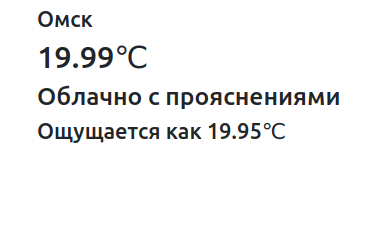
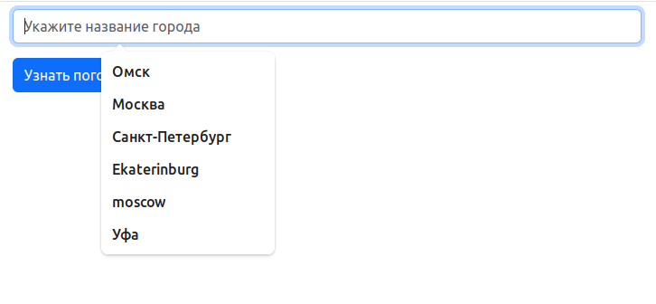
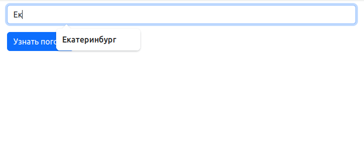
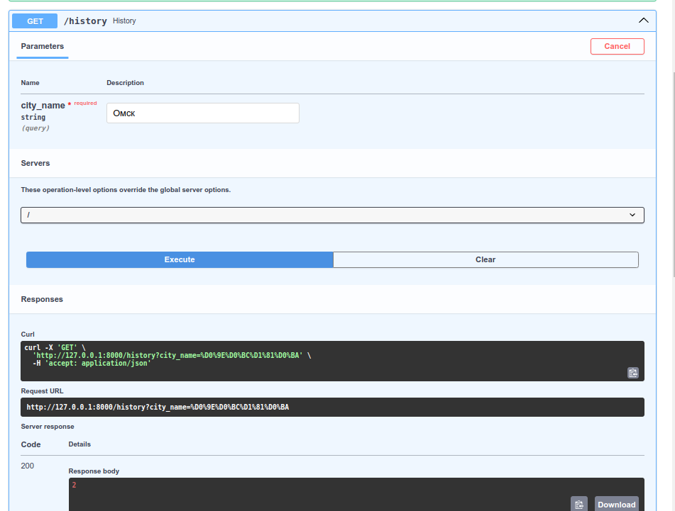
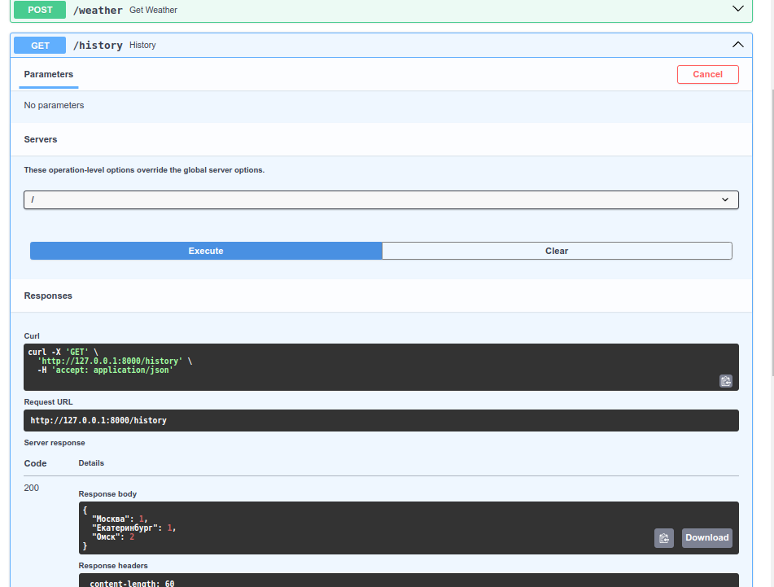

## Реализован функционал:

### Запуск тестов:

`pytest`

### Запуск докер контейнера:

`docker build -t myimage .`
`docker run -d --name mycontainer -p 80:80 myimage`
Или
`docker-compose build`
`docker-composee up`

### Автодополнение при вводе города (bootstrap из ранее введенных городов)

### Сохраняется история поиска для каждого пользователя. API, показывающее сколько раз вводили какой город

